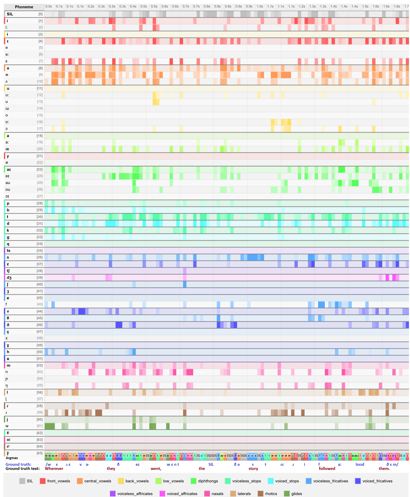
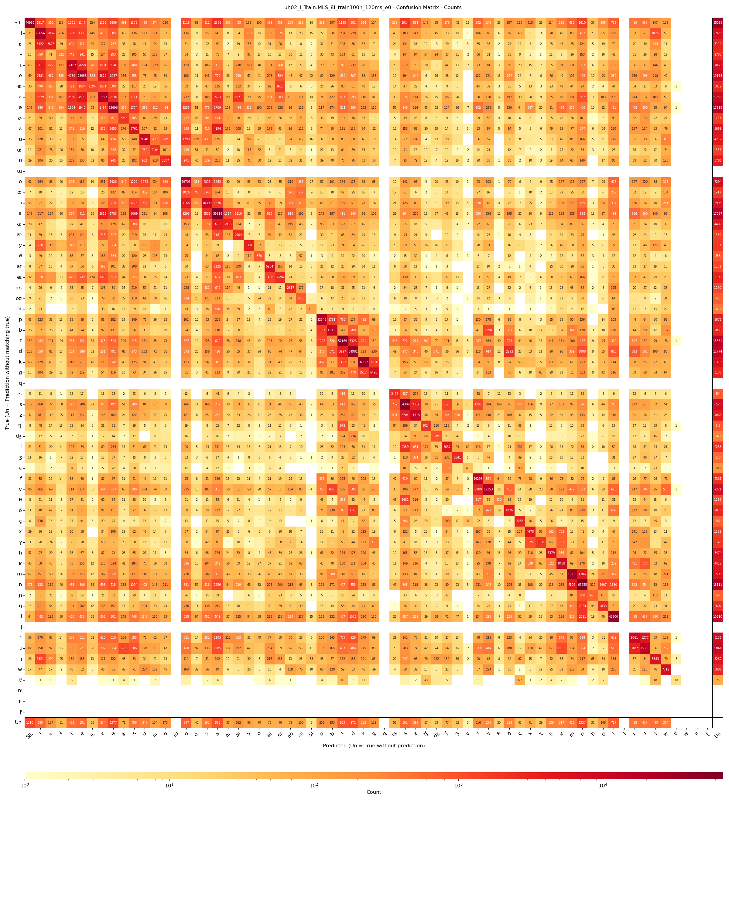
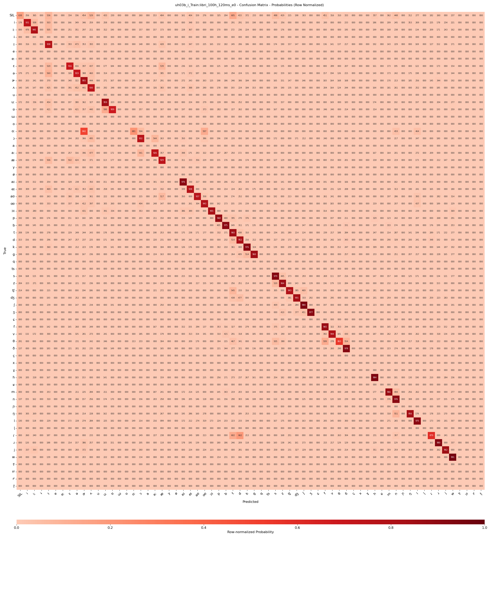

# 🗣️ CUPE: Contextless Universal Phoneme Encoder

[](https://huggingface.co/Tabahi/CUPE-2i)
[](https://github.com/tabahi/contexless-phonemes-CUPE)
[](https://arxiv.org/abs/2508.15316)
[](https://www.gnu.org/licenses/gpl-3.0)

> 🚀 **A PyTorch model for contextless phoneme prediction from speech audio**

CUPE processes 120ms frames independently, ensuring each frame's embeddings are acoustically pure—unlike transformer models that mix context across frames.

## 🔗 Quick Links

- 🎯 [**Bournemouth Forced Aligner**](https://github.com/tabahi/bournemouth-forced-aligner) - For phoneme/word timestamp alignment
- 📁 [**CUPE GitHub**](https://github.com/tabahi/contexless-phonemes-CUPE) - Source code repository  
- 🤗 [**CUPE Hugging Face**](https://huggingface.co/Tabahi/CUPE-2i) - Pre-trained models

---

## 🎯 Trained Models

> **📊 Three 30.1M parameter models available**

All models are available in the [**checkpoints directory**](https://huggingface.co/Tabahi/CUPE-2i/tree/main/ckpt).

### 📈 Model Performance

| 🏷️ **Model** | 🌍 **Languages** | 📊 **PER** | 📊 **GER** | 📝 **Description** |
|------------|-------------|----------|----------|--------------|
| 🇬🇧 **English** | English | **0.24** | **0.21** | 🏆 Best quality for English speech |
| 🌍 **Multilingual MLS** | 8 European | **0.31** | **0.26** | 🇪🇺 en, de, fr, es, pt, it, pl, nl |
| 🌐 **Multilingual MSWC** | 38 languages | **0.49** | **0.39** | 🗺️ Broad language coverage |

<details>
<summary>📋 <strong>Detailed Metrics</strong></summary>

**🇬🇧 English (New: Oct2025) ([en_libri1000_ua01c](https://huggingface.co/Tabahi/CUPE-2i/resolve/main/ckpt/en_libri1000_ua01c_e4_val_GER=0.2186.ckpt)):**
- 🎯 **PER:** 0.24 (Phoneme Error Rate)
- 🎯 **GER:** 0.22 (Phoneme Group Error Rate)
- Fixed rhotics and compound phonemes

**🇬🇧 English ([en_libri1000_uj01d](https://huggingface.co/Tabahi/CUPE-2i/resolve/main/ckpt/en_libri1000_uj01d_e199_val_GER=0.2307.ckpt)):**
- 🎯 **PER:** 0.25 (Phoneme Error Rate)
- 🎯 **GER:** 0.23 (Phoneme Group Error Rate)

**🌍 Multilingual MLS ([multi_MLS8_uh02](https://huggingface.co/Tabahi/CUPE-2i/resolve/main/ckpt/multi_MLS8_uh02_e36_val_GER=0.2334.ckpt)):**
- 🎯 **PER:** 0.31
- 🎯 **GER:** 0.26

**🌐 Multilingual MSWC ([multi_mswc38_ug20](https://huggingface.co/Tabahi/CUPE-2i/resolve/main/ckpt/multi_mswc38_ug20_e59_val_GER=0.5611.ckpt)):**
- 🎯 **PER:** 0.49
- 🎯 **GER:** 0.39

</details>

> ⚠️ **Note:** CUPE models are designed for contextless phoneme prediction and are not optimal for phoneme classification tasks that require contextual information. CUPE excels at extracting pure, frame-level embeddings that represent the acoustic properties of each phoneme independently of surrounding context.

---

## 📚 Datasets

### 🎵 Training Data Sources

- 📖 **LibriSpeech ASR corpus (SR12):** 960 hours of English speech
- 🌍 **Multilingual LibriSpeech (MLS):** 800 hours across 8 languages  
- 🗣️ **MSWC Multilingual Spoken Words:** 240 hours from 50 languages

<details>
<summary>🔍 <strong>Dataset Details</strong></summary>

**📖 LibriSpeech ASR corpus (SR12):** 
- ⏱️ 960 hours of English speech
- 📁 train-100, train-360, and train-500 splits

**🌍 Multilingual LibriSpeech (MLS) (SLR94):**
- ⏱️ 800 hours total (100 hours each)
- 🌐 8 languages: `pl`, `pt`, `it`, `es`, `fr`, `nl`, `de`, `en`

**🗣️ MSWC Multilingual Spoken Words Corpus:**
- ⏱️ 240 hours from 50 languages (max 10 hours/language)
- 🎓 **Training:** 38 languages (`en`, `de`, `fr`, `ca`, `es`, `fa`, `it`, `ru`, `pl`, `eu`, `cy`, `eo`, `nl`, `pt`, `tt`, `cs`, `tr`, `et`, `ky`, `id`, `sv-SE`, `ar`, `el`, `ro`, `lv`, `sl`, `zh-CN`, `ga-IE`, `ta`, `vi`, `gn`, `or`)
- 🧪 **Testing:** 6 languages (`lt`, `mt`, `ia`, `sk`, `ka`, `as`)

</details>

> 💡 **Need a new language?** Start a [new discussion](https://github.com/tabahi/bournemouth-forced-aligner/discussions) and we'll train it for you!

---

## 🚀 Installation 

### ⚡ Quick Start (Bournemouth Forced Aligner)

```bash
# 📦 Install the package
pip install bournemouth-forced-aligner

# 🔧 Install dependencies
apt-get install espeak-ng ffmpeg

# ❓ Show help
balign --help
```

📖 See complete [**BFA guide**](https://github.com/tabahi/bournemouth-forced-aligner).

### 🛠️ Quick Start (CUPE)

```bash
# 📦 Install core dependencies
pip install torch torchaudio huggingface_hub
```

---

## 💻 Easy Usage with Automatic Download

> 🎯 **Zero-setup required** - automatic downloads from Hugging Face Hub

### 🦋 Example Output
Running with sample audio [🦋 butterfly.wav](samples/109867__timkahn__butterfly.wav.wav):

```bash
🔄 Loading CUPE english model...
✅ Model loaded on cpu
🎵 Processing audio: 1.26s duration
📊 Processed 75 frames (1200ms total)

📋 Results:
🔤 Phoneme predictions shape: (75,)
🏷️ Group predictions shape: (75,)
ℹ️ Model info: {'model_name': 'english', 'sample_rate': 16000, 'frames_per_second': 62.5}

🔍 First 10 frame predictions:
Frame 0: phoneme=66, group=16
Frame 1: phoneme=66, group=16
Frame 2: phoneme=29, group=7
...

🔤 Phonemes: ['b', 'ʌ', 't', 'h', 'ʌ', 'f', 'l', 'æ']...
🏷️ Groups: ['voiced_stops', 'central_vowels', 'voiceless_stops']...
```

### 🐍 Python Code

```python
import torch
import torchaudio
from huggingface_hub import hf_hub_download
import importlib.util

def load_cupe_model(model_name="english", device="auto"):
    """🔄 Load CUPE model with automatic downloading from Hugging Face Hub"""
    
    model_files = {
        "english": "en_libri1000_uj01d_e199_val_GER=0.2307.ckpt",
        "multilingual-mls": "multi_MLS8_uh02_e36_val_GER=0.2334.ckpt", 
        "multilingual-mswc": "multi_mswc38_ug20_e59_val_GER=0.5611.ckpt"
    }
    
    if device == "auto":
        device = "cuda" if torch.cuda.is_available() else "cpu"
    
    # 📥 Download files automatically from Hugging Face Hub
    repo_id = "Tabahi/CUPE-2i"
    model_file = hf_hub_download(repo_id=repo_id, filename="model2i.py")
    windowing_file = hf_hub_download(repo_id=repo_id, filename="windowing.py") 
    checkpoint = hf_hub_download(repo_id=repo_id, filename=f"ckpt/{model_files[model_name]}")
    model_utils_file = hf_hub_download(repo_id=repo_id, filename="model_utils.py")
    
    # 🔧 Import modules dynamically
    _ = import_module_from_file("model_utils", model_utils_file)
    spec = importlib.util.spec_from_file_location("model2i", model_file)
    model2i = importlib.util.module_from_spec(spec)
    spec.loader.exec_module(model2i)
    
    spec = importlib.util.spec_from_file_location("windowing", windowing_file)
    windowing = importlib.util.module_from_spec(spec)
    spec.loader.exec_module(windowing)
    
    # 🚀 Initialize model
    extractor = model2i.CUPEEmbeddingsExtractor(checkpoint, device=device)
    return extractor, windowing

# 🎯 Example usage
extractor, windowing = load_cupe_model("english")

# 🎵 Load and process your audio
audio, sr = torchaudio.load("your_audio.wav")
if sr != 16000:
    resampler = torchaudio.transforms.Resample(sr, 16000)
    audio = resampler(audio)

# 📊 Add batch dimension and process
audio_batch = audio.unsqueeze(0)
windowed_audio = windowing.slice_windows(audio_batch, 16000, 120, 80)
batch_size, num_windows, window_size = windowed_audio.shape
windows_flat = windowed_audio.reshape(-1, window_size)

# 🔮 Get predictions
logits_phonemes, logits_groups = extractor.predict(windows_flat, return_embeddings=False, groups_only=False)

print(f"🔤 Phoneme logits shape: {logits_phonemes.shape}")  # [num_windows, frames_per_window, 66]
print(f"🏷️ Group logits shape: {logits_groups.shape}")     # [num_windows, frames_per_window, 16]
```

---

## 🔧 Advanced Usage (Manual Setup)

<details>
<summary>📁 <strong>Manual Setup Code</strong></summary>

For more control, see [run.py](https://huggingface.co/Tabahi/CUPE-2i/blob/main/run.py):

```python
import torch
import torchaudio
from model2i import CUPEEmbeddingsExtractor  # 🎯 Main CUPE model feature extractor
import windowing  # 🔧 Provides slice_windows, stich_window_predictions

# 📁 Load model from local checkpoint
cupe_ckpt_path = "./ckpt/en_libri1000_uj01d_e199_val_GER=0.2307.ckpt"
extractor = CUPEEmbeddingsExtractor(cupe_ckpt_path, device="cuda")

# 🎵 Prepare audio
sample_rate = 16000
window_size_ms = 120
stride_ms = 80
max_wav_len = 10 * sample_rate  # 10 seconds

dummy_wav = torch.zeros(1, max_wav_len, dtype=torch.float32, device="cpu")
audio_batch = dummy_wav.unsqueeze(0)  # Add batch dimension

# 🪟 Window the audio
windowed_audio = windowing.slice_windows(
    audio_batch.to("cuda"),
    sample_rate,
    window_size_ms,
    stride_ms
)
batch_size, num_windows, window_size = windowed_audio.shape
windows_flat = windowed_audio.reshape(-1, window_size)

# 🔮 Get predictions
logits, _ = extractor.predict(windows_flat, return_embeddings=False, groups_only=False)

# 🔄 Reshape and stitch window predictions
frames_per_window = logits.shape[1]
logits = logits.reshape(batch_size, num_windows, frames_per_window, -1)
logits = windowing.stich_window_predictions(
    logits,
    original_audio_length=audio_batch.size(2),
    cnn_output_size=frames_per_window,
    sample_rate=sample_rate,
    window_size_ms=window_size_ms,
    stride_ms=stride_ms
)

print(f"📊 Output shape: {logits.shape}")  # [B, T, 66]
```

</details>

---

## 📊 Output Format

- 🔤 **Phoneme logits**: `(time_frames, 66)` - 66 IPA phoneme classes
- 🏷️ **Group logits**: `(time_frames, 16)` - 16 phoneme groups  
- ⏱️ **Time resolution**: ~16ms per frame (~62.5 FPS)
- 🗺️ **Mapping**: See [mapper.py](https://huggingface.co/Tabahi/CUPE-2i/blob/main/mapper.py) for phoneme-to-index mapping

---

## ✨ Key Features

- 🚀 **No manual downloads** - automatic via Hugging Face Hub  
- 🌍 **Multiple languages** - English + 37 other languages  
- ⚡ **Real-time capable** - faster than real-time on GPU  
- ⏱️ **Frame-level timing** - 16ms resolution  
- 🎯 **Contextless** - each frame processed independently

---

## 🎨 Custom Dataset for Training

<details>
<summary>🔧 <strong>Training Setup</strong></summary>

- 📋 See [mapper.py](https://huggingface.co/Tabahi/CUPE-2i/blob/main/mapper.py) for tokenization (66 phonemes + 16 groups)
- 🔤 Use IPA-based grapheme-to-phoneme tools: [Espeak-ng](https://pypi.org/project/espeakng/)
- 📝 Convert words to IPA sequences: [phonemizer](https://pypi.org/project/phonemizer/3.0.1/)
- 🗺️ Map IPA phonemes to tokens: [IPAPhonemeMapper](https://github.com/tabahi/IPAPhonemeMapper)

**Token Mapping:**
- Token 0: 🔇 Silence
- Tokens 1-65: 🔤 IPA phonemes  
- Token 66: 📻 Blank/noise

</details>

---

## 🎯 Use Cases

- ⏰ **Timestamp alignment** (examples coming soon)
- 📊 **Speech analysis**
- 🔍 **Phoneme recognition**
- 🎵 **Audio processing**

---

## 📊 Visual Results

### 📈 Sample Probabilities Timeline


### 🌍 Multilingual Confusion Plot


### 🇬🇧 English-only Confusion Plot  


---

## 📖 Citation

📄 **Paper**: [CUPE: Contextless Universal Phoneme Encoder for Language-Agnostic Speech Processing](https://arxiv.org/abs/2508.15316)

```bibtex
@inproceedings{rehman2025cupe,
  title     = {CUPE: Contextless Universal Phoneme Encoder for Language-Agnostic Speech Processing},
  author    = {Abdul Rehman and Jian-Jun Zhang and Xiaosong Yang},
  booktitle = {Proceedings of the 8th International Conference on Natural Language and Speech Processing (ICNLSP 2025)},
  year      = {2025},
  organization = {ICNLSP},
  publisher = {International Conference on Natural Language and Speech Processing},
}
```

---

<div align="center">

### 🌟 **Star this repository if you find it helpful!** ⭐

[](https://github.com/tabahi/contexless-phonemes-CUPE)
[](https://huggingface.co/Tabahi/CUPE-2i)

</div>